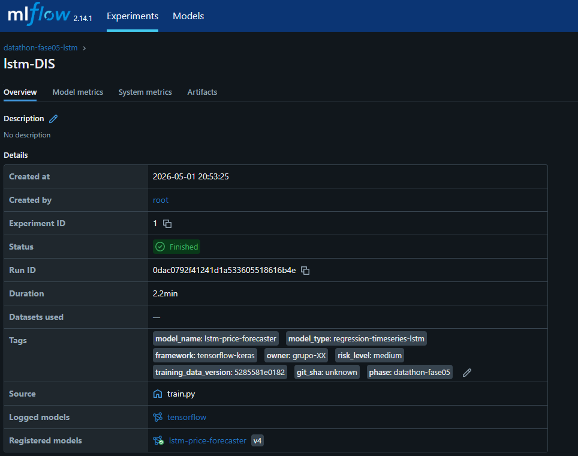
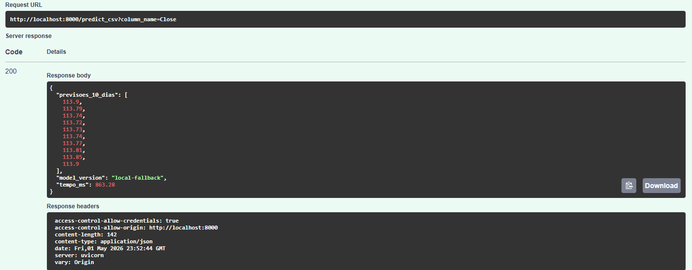
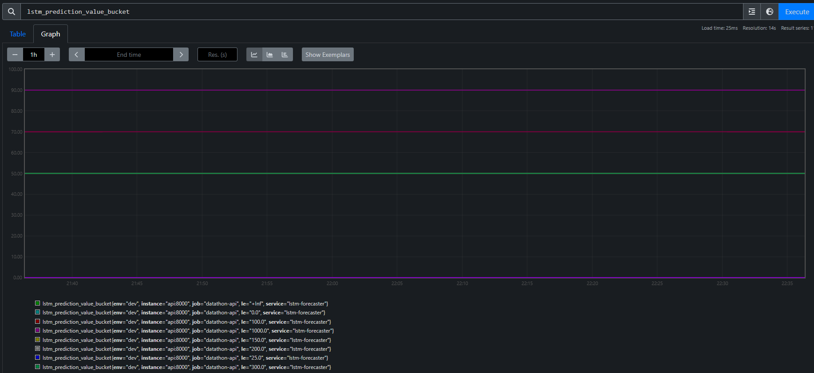
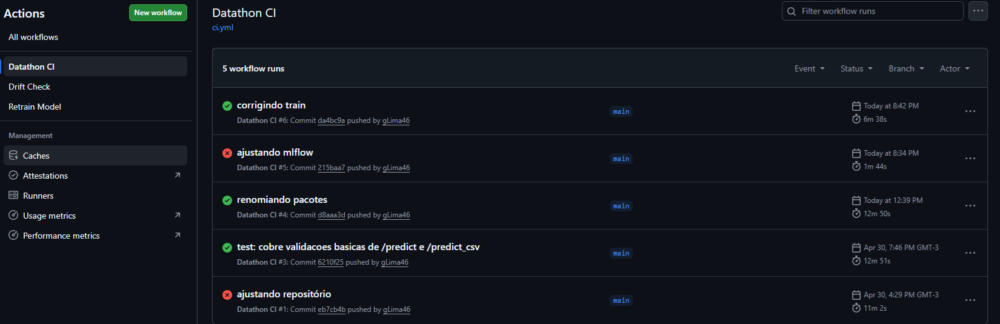

# Datathon FIAP — Fase 05 — Plataforma MLOps

[](https://github.com/gLima46/Tech-Challenge-Datathon/actions/workflows/ci.yml)
[](https://www.python.org/downloads/)
[](#)

> Plataforma MLOps end-to-end para previsão de séries temporais financeiras.
> Trabalho de conclusão da Fase 05 (LLMs e Agentes / MLOps) do curso de
> Engenharia de Machine Learning - FIAP.

A entrega ataca os **9 gaps de plataformas de ML** levantados pelo enunciado
oficial do Datathon, transformando um modelo LSTM da Fase 4 numa plataforma
MLOps completa: tracking, versionamento, observabilidade, drift detection,
retraining automatizado e CI/CD.

## Demo rápida

| Componente | Print |
|---|---|
| MLflow Registry com tags obrigatórias |  |
| API FastAPI servindo do Registry |  |
| Métricas Prometheus customizadas |  |
| CI/CD verde no GitHub Actions |  |

## Stack

- **Treino:** TensorFlow 2.16 / Keras 3
- **Tracking & Registry:** MLflow 2.14
- **Versionamento de dados:** DVC
- **Serving:** FastAPI + Uvicorn
- **Observabilidade:** Prometheus (`/metrics` exposto via instrumentator)
- **Drift:** PSI implementado nativamente + Evidently
- **Validação de schema:** Pandera
- **Qualidade:** ruff, mypy, bandit, pytest, pre-commit
- **CI/CD:** GitHub Actions (lint + test + docker build)
- **Orquestração local:** Docker Compose

## Quickstart

```bash
# 1. Setup
pip install -e ".[dev]"

# 2. Sobe MLflow local
mlflow server --host 0.0.0.0 --port 5000 --backend-store-uri sqlite:///mlflow.db

# 3. Treina modelo (loga no MLflow Registry)
python -m src.models.train

# 4. Promove versão para production
# Via UI MLflow: lstm-price-forecaster → Version N → Add alias "production"

# 5. Sobe API
uvicorn src.serving.app:app --reload --port 8000

# 6. Testa
curl http://localhost:8000/docs
```

## Estrutura
## Mapeamento dos 9 Gaps

| # | Gap | Solução |
|---|---|---|
| 01 | Sem monitoramento | Prometheus instrumentando FastAPI; `/metrics` exposto |
| 02 | SPOF em notebook | Pipeline DVC com stages isolados; sem `.ipynb` em produção |
| 03 | Feature store destrutivo | **Não aplicável** — modelo univariado; justificativa em [`docs/ARCHITECTURE.md`](docs/ARCHITECTURE.md) |
| 04 | Sem testes | pytest 28 testes, cobertura 61%, threshold 60% obrigatório no CI |
| 05 | Sem versionamento de modelo | MLflow Registry com 8 tags obrigatórias e alias `production` |
| 06 | Sem drift detection | PSI implementado + endpoint `POST /monitoring/drift` |
| 07 | Sem retraining automatizado | GitHub Actions agendado + event-driven via drift |
| 08 | Dev sem dados | DVC versiona pipeline; `yfinance` reproduz dataset |
| 09 | Skill gap eng. software | Type hints, ruff, mypy, bandit, pre-commit, docstrings, CI verde |

Detalhes em [`docs/ARCHITECTURE.md`](docs/ARCHITECTURE.md).

## Documentação

- [Arquitetura](docs/ARCHITECTURE.md) — visão geral, decisões de design, justificativa do Gap 03
- [Model Card](docs/MODEL_CARD.md) — uso pretendido, limitações, métricas, monitoramento
- [Runbook](docs/RUNBOOK.md) — operação, rollback, resposta a drift

## Notas sobre o CI

A cobertura local é **~61%**, mas no CI roda apenas a parte unitária (testes
de integração da API são pulados sem `artifacts/modelo_lstm.keras` treinado).
O threshold de **60%** está enforced em `--cov-fail-under=60`. Para rodar a
suíte completa localmente, treine o modelo antes:

```bash
python -m src.models.train
pytest tests
```

## Stack completa via Docker

```bash
docker compose up -d --build
```

Endpoints:
- API: http://localhost:8000/docs
- MLflow: http://localhost:5000
- Prometheus: http://localhost:9090
- Grafana: http://localhost:3000 (admin/admin)
